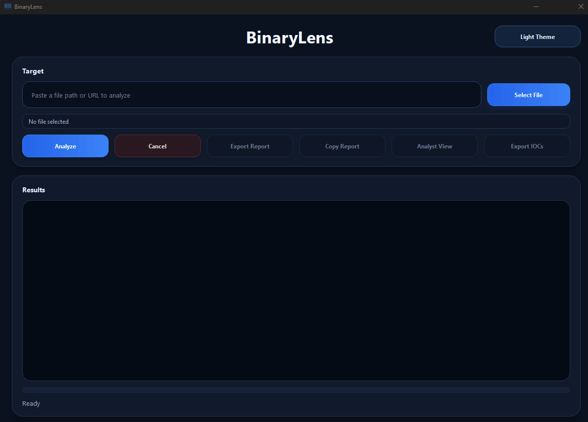

# BinaryLens

<p align="right">
  <a href="./README.md">
    
  </a>
  <a href="./README_pt-BR.md">
    
  </a>
</p>

<p align="center">
  
  
  
  
  
  
</p>

BinaryLens is a Windows desktop triage tool for inspecting suspicious **files, URLs, and IPs**.

It is built in **C++**, uses a **Qt desktop UI**, and includes **assembly-assisted pattern scanning** for lower-level matching work. The goal is to surface useful signals quickly and make follow-up investigation easier.

BinaryLens is not meant to replace a sandbox, an EDR, or full manual reverse engineering. It is a first-pass tool, and also a practical project for people who want to study how this kind of desktop security tooling can be built.

---

## Download

If you only want to use the app, download the latest Windows package from the Releases page:

- [Download the latest BinaryLens release](https://github.com/MrcVnz/BinaryLens/releases/download/v1.0.0/BinaryLens-v1.0.0-win64.zip)

The packaged release already includes the executable and the Qt runtime files required to run BinaryLens. No separate Qt installation is needed.

---

## Demo

Quick look at the current desktop workflow:

<p align="center">

</p>

---

## Who this is for

BinaryLens is mainly aimed at:

- cybersecurity students
- reverse engineering beginners
- malware triage learners
- developers interested in native Windows security tooling
- people who want to study a practical **C++ + Qt + MASM** project

This project makes the most sense for learners who already know basic programming and want to move into Windows-focused security tooling.

## What it does

- scans local files, URLs, and IP targets from a desktop UI
- combines multiple analysis signals into a single report
- uses checks such as:
  - hash generation
  - PE parsing
  - import inspection
  - archive inspection
  - embedded payload checks
  - script abuse indicators
  - YARA-based matching
  - basic VirusTotal lookups
- includes assembly-backed pattern scanning for performance-sensitive matching work
- supports report export, IOC export, clipboard copy, and analyst-oriented views

## Typical use cases

You can use BinaryLens to:

- inspect a suspicious file before deeper analysis
- get a quick first-pass view of a URL or IP
- export reports and IOCs for follow-up work
- study how a native Windows triage tool is structured internally

## Project layout

```text
BinaryLens/
├─ BinaryLens/
│  ├─ asm/
│  ├─ config/
│  ├─ include/
│  ├─ plugins/
│  ├─ rules/
│  └─ src/
│     ├─ analyzers/
│     ├─ asm/
│     ├─ core/
│     ├─ scanners/
│     └─ services/
├─ qt_app/
│  ├─ include/
│  ├─ resources/
│  └─ src/
├─ CMakeLists.txt
└─ .gitignore
```

## Requirements

- Windows 10 or 11
- Visual Studio 2022 or newer with C++ desktop tools
- CMake 3.21+
- Qt 6 (this project was built around **Qt 6.10.2 msvc2022_64**)
- MASM / ml64 (installed with Visual Studio)

## Clone the repository

Using Git:

```bash
git clone https://github.com/MrcVnz/BinaryLens.git
cd BinaryLens
```

Or download the project as a ZIP directly from GitHub and extract it locally.

## Building

Open the project root in Visual Studio as a **CMake project**.

If Qt is not installed in the default path used by this repo, set `CMAKE_PREFIX_PATH` to your Qt installation before configuring.

Expected default Qt path:

```text
C:/Qt/6.10.2/msvc2022_64
```

### Build steps

1. Open the root folder in Visual Studio
2. Let CMake configure the project
3. Build the `BinaryLensQt` target
4. Run the generated executable

The project can be configured to call `windeployqt` after build so the Qt runtime is copied next to the executable automatically.

## VirusTotal configuration

There are two supported ways to use the VirusTotal integration:

### 1. Prebuilt release / packaged executable

The Windows release build can be packaged so VirusTotal works without asking the end user to create a `config.json` next to the executable.

That is meant for people who only want to download the app and use it.

### 2. Building from source

If you clone the repository and build BinaryLens yourself, create this file locally:

```text
BinaryLens/config/config.json
```

You can copy the example file below and fill in your own key:

```text
BinaryLens/config/config.example.json
```

Expected format:

```json
{
  "virustotal_api_key": "PASTE_YOUR_VIRUSTOTAL_API_KEY_HERE"
}
```

## Notes

- The current desktop app entry point is the **Qt** frontend.
- The repo does **not** include build output, deployed Qt DLLs, or personal runtime secrets.
- BinaryLens should be treated as a triage and learning tool, not as a final authority on whether something is malicious.

## Why the repo is structured this way

This project grew in stages. The core analysis code, the assembly work, and the Qt UI live in separate areas on purpose so the codebase stays easier to reason about.

- `BinaryLens/src/core` holds the analysis flow and verdict logic
- `BinaryLens/src/analyzers` holds feature-specific analysis modules
- `BinaryLens/src/services` covers external-facing helpers such as API usage
- `BinaryLens/src/asm` and `BinaryLens/asm` hold the C++ / MASM bridge and low-level routines
- `qt_app` contains the current desktop interface

## Current status

BinaryLens is a personal project. Expect rough edges, experiments, and fast changes.

If you clone it, treat it like a real development repo, not a finished commercial product.

## Creator

GitHub: **MrcVnz**
